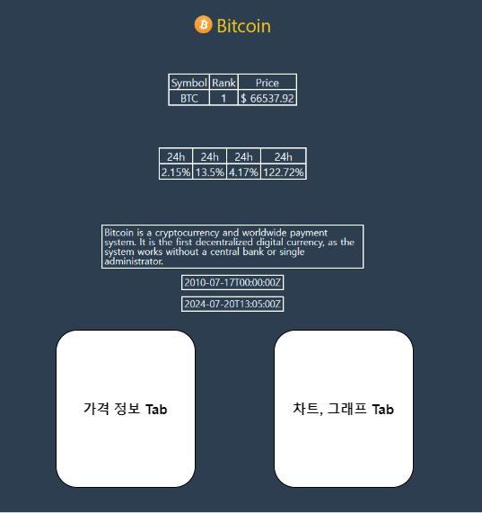
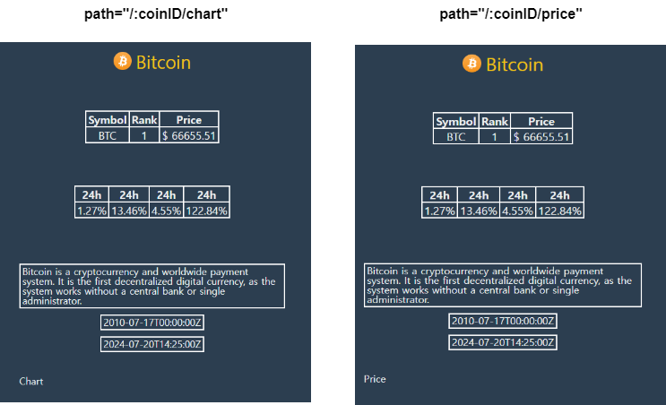

### \#\ 5.7 ~ 5.8 (Nested Routes)

#### `Nested Route`

- `Route` 내부에 존재하는 또 다른 `route` -- `Nested Route`
- `Coin Detail` 페이지에 데이터를 표시하는 것까지 완료했으니 <br/>
	이번에는 `가격 정보`와 `차트, 그래프` 같은 것을 아래 이미지와 같이 표시하려고 한다.
- 물론 해당 페이지들을 `state`에서 제어하지 않고, `URL`에서 제어하게 하고 싶다.
- 그런 경우에 사용할 수 있는 방법이 `Nested Route`이다.




---

### `Price`, `Chart` Route

- `/Route` 내부에 `Price.tsx `, `Chart.tsx` 생성
- 그리고 위의 두 `Route`를 `Coin.tsx / Coin Detail Page's`에서 Rendering해준다.
- 강의에서는 `react-router`의 `<Switch>` Component 사용해서 <br/>
	`Nested route` 구현했지만 현재 사용 중인 `React router`는 `v6`이므로 <br/>
	아래와 같이 `react-router 6 버전`에 맞는 문법을 사용해서 `Nested route` 구현하였다.

- 먼저 `Router.tsx`에서 `coin route`의 `path`, `url` 값의 마지막에 `/*` 추가한다.
- 이는 해당 `route` 내부에서 `nested route`가 render 될 수 있음을 명시하는 것으로 <br/>
	자식 `route`를 부모 `route`의 `element (<Coin/>)` 내부에 작성할 때 사용한다. <br/>
	(강의에서 사용된 방법)

- `Coin.tsx`에서 `<Price/>`와 `<Chart/>` 두 `route`를 `nested route` 추가하였다.

``` tsx
//react-router 6, route 작성법 적용
import {Routes, Route} from "react-router-dom";

function Coin(){
	/*code*/
	return (
		<div>
			/*Coin Detail Page's Components*/
			<Routes>
				<Route path="chart" element={<Chart />}/>
				<Route path="price" element={<Price />}/>
			</Routes>
		</div>
	);
}
```

- 사용자가 `/:coinID` URL 뒤에 `/chart`, `/price` 입력하면 아래 이미지처럼 <br/>
	기존 `Coin Detail` 페이지에서 `Chart`나 `Price` 문구가 추가된다.



---

