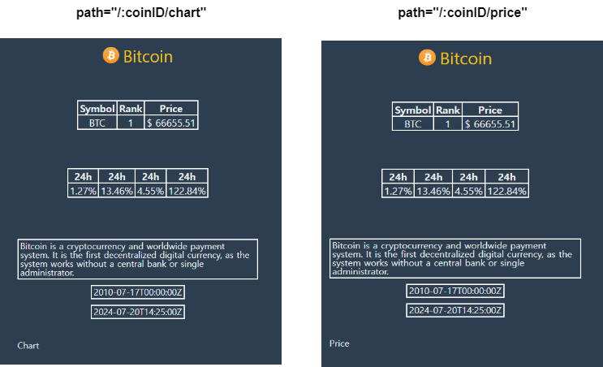

### \#\ 5.8 `Nested Routes Part II` 이어하기

- 저번에 API 서버 Issue로 끝내지 못했던 `Nested Routes part 2` 부분을 <br/>
	오늘 이어서 진행하였다.



- 이전 파트에서 `coin detail` 페이지에 `chart`, `price`를 `nested Routes`로 추가하였다.
- `/:coinID/('price' or 'chart')` URL을 입력하면 위의 이미지처럼 <br/>
	기존 `coin detail` 페이지에서 하단에 `Chart/Price` 문구가 추가된다. <br/>
	(입력한 URL에 따라 다르다. )

- 이번에는 별도의 URL 입력 없이, `Chart / Price` 바뀌는 스위치 탭을 추가하였다.

- `Tabs`와 `Tab`이라는 이름의 `styled-components` 만들고 <br/>
	아래와 같이 `react-router`의 `<Link>` Component 통해서 화면 전환을 구현하였다.

``` tsx
/*
function Coin(){
	return (*/
		<Tabs>
			<Tab><Link to={`/${coinID}/chart`}>Chart</Link></Tab>
			<Tab><Link to={`/${coinID}/price`}>Price</Link></Tab>
		</Tabs>
	/*);
}*/
```


---

- 이제 사용자가 어느 URL에 있는 지를 확인할 수 있게 해보자.
- `react-router`의 `useMatch()`  Hook은 현재 위치를 기준으로 <br/>
	지정된 경로에 대한 일치 데이터를 반환하는 Hook이다.

- 강의에서는 `useRouteMatch()` Hook을 사용했지만 <br/>
	`react-router ver 6`에서는 `useRouteMatch()`가 사라지고, `useMatch()` 사용했다.

``` tsx
import {useMatch} from "react-router-dom";

function Coin(){
	const PriceMatch = useMatch("/:coinID/price");
	console.log(PriceMatch);
}
```

- console을 통해 확인해보면, URL에 따라 `object` 혹은 `null`이 return되는 것을 확인할 수 있다.
- 이제 `Chart`, `Price` 구분을 쉽게 하기 위해서, `<Tab>`에 `isActive` props 추가하고 <br/>
	`isActive` props에 전달된 `boolean` 값에 따라 글자 색이 달라지게 한다.

- `URL`이 `/:coinID/chart` 혹은 `/:coinID/price` 인지를 확인해서 <br/>
	해당되는 `<Link>` 탭의 글자 색이 `theme`에서 지정한 `accentColor`로 바뀌게 된다.

- 이를 통해서 사용자가 웹 페이지에서 어느 URL에 접속 중 인지를 <br/>
	이전보다 좀 더 직관적으로 확인할 수 있다.


---


