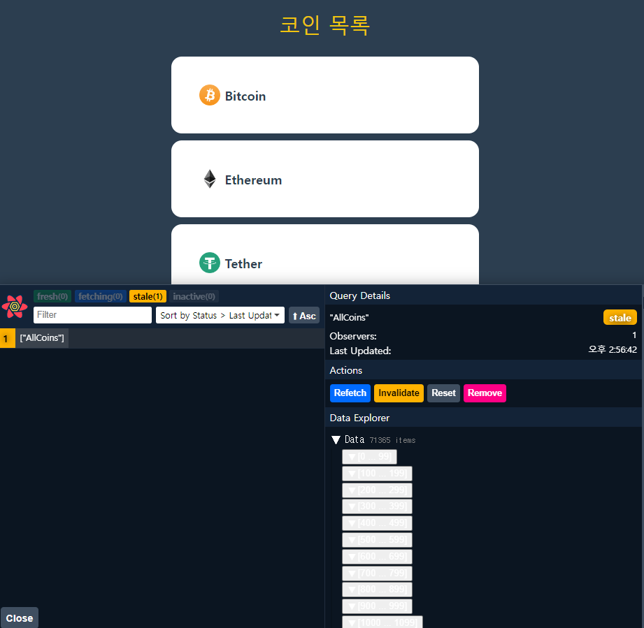

### `react query`

- Application의 데이터를 관리하고 동기화 하는데 사용하는 `Library`
- 상태 관리 라이브러리

```
React Query 사용하는 이유
1. 간편한 데이터 관리
- 데이터 가져오고, 캐싱, 동기화 및 업데이트 처리를 간편하게 할 수 있게 해준다.

2. 실시간 업데이트 및 동기화
- 실시간 데이터 업데이트 및 자동 동기화를 지원하여
  서버와 클라이어트 데이터의 일관성을 유지한다.
  
3. 데이터 캐싱
- 데이터를 캐싱하여 불필요한 API 요청을 줄이고
  애플리케이션의 성능을 향상시킨다.
  
4. 서버 상태 관리
- 로딩중, 에러, 성공 등의 서버 상태에 따른 관리를 간편하게 처리할 수 있다.
```

---

#### `react query` 설치 및 세팅

- `create-react-app` 통해서 `react project` 생성했다면 <br/>
	아래 명령어를 입력할 필요는 없다.

``` shell
npm install react-query
```

- `react-query` 설치를 완료했다면, `React App`에서 <br/>
	최상위 Component를 `<QueryClientProvider>`로 감싸줘야 한다.

``` tsx
import {QueryClient, QueryClientProvider} from "react-query";

const queryClient = new QueryClient();

function App(){
	return (
		<QueryClientProvider client={queryClient}>
			<div className="App"></div>
		</QueryClientProvider>
	);
}
```

- `React Query` 사용하고자 하는 Component를 `<QueryClientProvider>` 감싸주고 <br/>
	앞에서 선언한 `QueryClient` 값을 `<QueryClientProvider>`의 `client`에 전달한다.

---
### \#\ 5.9 React Query (2024.07.29)

- 기존에는 Open API 통해서 Coin Data를 수동으로 가져오고 <br/>
	가져온 데이터를 화면에 띄우기 전까지 나오는 로딩 메시지까지 <br/>
	일일히 수동으로 작성했었다.

- `react-query` 사용하면, 이러한 일련의 과정들을 자동으로 처리해준다.
- 본격적으로 사용하기 전에 데이터를 가져오는 `fetcher` 함수를 만들어보자. <br/>
	(`API`와 관련된 코드들을 Component에서 분리하기 )

- `api.ts` 파일을 생성하고, `coin data` 가져오던 `api` 관련 코드를 이관하였다.<br/>
	(`FetchCoins` 함수에 `Logic` 이동) 

``` ts
//api.ts
export async function FetchCoins(){
	return fetch("https://api.coinpaprika.com/v1/coins").then(
		(resp) => resp.json();
	);
}
```

- `api` 통해서 `coin data` 가져오는 `Logic`을 별도의 함수로 이관했으니 <br/>
	이제 `coins.tsx`에서 이를 `import`해서 `coin data` 가져올 것이다.

``` tsx
function Coins(){
	//New
	const {isLoading, data} = useQuery<I_Coin[]>("AllCoin", FetchCoins);
	
	return (
		<div>...</div>
	);
}
```

- 기존의 `coins`, `Loading` 변수를 참조하던 코드 모두 `isLoading`, `data` 수정하였다.

---

### `useQuery()` 관련 issue

#### 1. 변수 `data`의 이름을 `CoinData` 변경하기

- `queryFunction`의 `return` 값이 변수 `data`에 저장됐는데 <br/>
	해당 변수의 이름을 내가 원하는 이름으로 바꾸고 싶어졌다.
- 바로 아래와 같이 변수 이름을 수정했는데 Error가 발생하였다.

``` tsx
function Coins(){
	//const {isLoading, data} = useQuery("AllCoins", FetchCoins);
	const {isLoading, CoinData} = useQuery("AllCoins", FetchCoins); //Error
}
```

- Error Message는 다음과 같이 나왔다.

```
'QueryObserverIdleResult<I_Coin[], unknown> | QueryObserverLoadingErrorResult<I_Coin[], unknown> | QueryObserverRefetchErrorResult<I_Coin[], unknown> | QueryObserverSuccessResult<...>' 형식에 'CoinData' 속성이 없습니다.

UseQueryResult<I_Coin[], unknown> 형식에 'CoinData' 속성이 없습니다.
```

- 공식 문서와 `useQuery()`와 관련된 블로그 글들을 통해서 알게된 것은
- 변수 `data, isLoading`은 `useQuery` 함수가 제공하는 기본 변수라는 것과 <br/>
	내가 임의로 추가한 `CoinData`는 당연히 `useQueryResult`에서 명시되지 않은 <br/>
	`property`이기 때문에 `Error`가 발생할 수 밖에 없다는 것이었다.
- `react-query`의 `useQueryResult`에 `CoinData` 속성을 추가할 수는 없기 때문에 <br/>
	더 좋은 방법이 없을까 하고 구글링을 하다가 `ES6 alias` 문법을 활용하면
- `data`의 이름을 내가 원하는 이름으로 바꿀 수 있다는 것을 알게 됐다.

- 아래와 같이 코드를 수정하니, `Error`가 발생하지 않게 됐다.

``` tsx
function Coins(){
	//const {isLoading, data} = useQuery("AllCoins", FetchCoins);
	const {isLoading, data: CoinData} = useQuery("AllCoins", FetchCoins); //Error
}
```

- 다만 `ES6 alias`에 대해선 알아보지 않는 상태로 적용했기 때문에
- 이게 어떻게 이렇게 됐는지에 대해서는 이해하지 못했다.
- 이건 쉬는 날에 찾아봐야 할 것 같다.

---
#### 2. 메인 홈 로딩 속도 느려지는 이슈 해결하기

- 기존에 `useEffect` Hook 활용해서 `coin data`를 `fetch`해오던 부분<br/>
	`api` 관련 코드를 `FetchCoins` 함수에 이관하고, `data fetch`하는 것을 <br/>
    `React Query`의 `useQuery()` Hook으로 변경하니 새로운 문제가 발생하였다.

- `React Query`로 업데이트하는 과정에서 `Coin Data`를 `slice`하지 않아서 <br/>
	로딩 속도가 매우 늘어나고, 반응도 느려지는 문제가 발생하였다.

- 이는 의도한 바가 아니기 때문에 개선할 방법을 찾아봤고 <br/>
	`useQuery`의 세 번째 매개변수인 `option`의 설정, `select` 통해서 해결 가능하다고 한다.

#### `select`

- `queryFunction`이 반환하는 데이터 일부를 변환하고자 할 때
- 사용할 수 잇는 `option` 속성이다.
- 아래와 같이 `slice()` 함수를 사용해서 `queryFunction`의 `return` 값인 <br/>
	수많은 `Coin Data`들 중에서 `0 ~ 50` 사이의 `data`만 취하였다.

``` tsx
function Coins(){
	const [isLoading, data: CoinData] = useQuery<I_Coin[]>(
		"AllCoin", FetchCoins, {select: (d) => d.slice(0, 50)}
	);
}
```

- 처음 `coin data` 받아올 때, 가져오는 개수에 제한을 두지 않으면 <br/>
	대량의 수많은 `coin data`를 가져오고, 이는 웹 사이트의 로딩 속도에도 악영향을 준다.

---
### 번외. `React Query Devtools` (2024.07.31)

- `React Query`의 모든 내부 작동을 시각화해서 보여주는 도구

``` tsx
//in App.tsx
import {ReactQueryDevtools} from "react-query/devtools";

<ReactQueryDevtools initiallsOpen={false}/>
```

- 위와 같이 `ReactQueryDevtools`를 `App.tsx`에서  import하면 <br/>
	아래 이미지와 같이 `React Query`의 내부 동작을 확인할 수 있다.



---
### \#\ 5.10 React Query (2024.08.03)

- `coins.tsx`에서 한 것과 동일하게 `coin.tsx`에도 똑같이 업데이트를 진행하였다.

- `useQuery` 통해서 가져온 `coin data`가 `cache` 저장된 상태이면 <br/>
	다른 페이지로 넘어갔다가 다시 복귀해도 로딩 하는데 시간이 걸리지 않는다.

- 매번 `api` 서버로부터 데이터를 새로 받아오는 것이 아닌 <br/>
	`cache`에 저장된 `data` 띄우기 때문에 이미 들어갔던 페이지는 금방 랜더링된다.


---

#### `useQuery()`

``` ts
const {isLoading, data, error} = useQuery("Key", queryFunction, options);
```

- 
