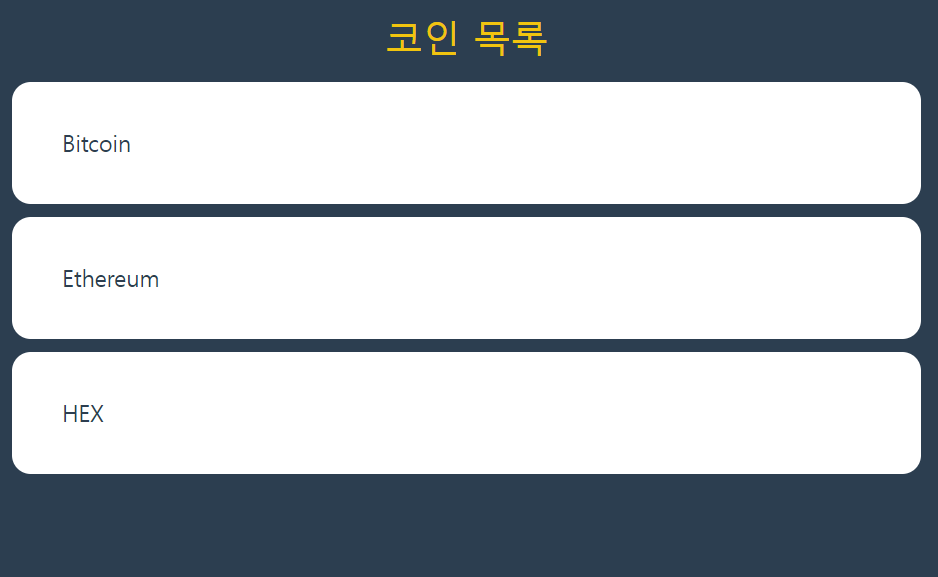
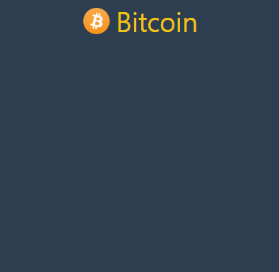

## Crypto Tracker

- React Side Project
- 코인, 암호화폐의 가격을 보여주는 웹 사이트 구현하기

#### 💻 Use Stack's
- `TypeScript`, `React`
- `React Router ver6`, `react-query`, `styled-components`
- **[Coinpaprika api](https://coinpaprika.com/api/)**

---

### 2024.07.10 : route 작업

```
Crypto Tracker, Routing Setting

/ (Home)
- 모든 코인(암호화폐)에 대한 정보들을 보여주는 페이지

/:coinID
- 'coinID'와 일치하는 id를 가진 코인에 대한 상세 정보를 보여주는 페이지
- 예를 들어서 coinID가 'btc'라면 btc, bit coin에 대한 상세 정보를 보여준다.
```

---

### 2024.07.15 : style 작업
- 기존 styled-components는 개별 Component에만 style이 적용됐었다.
- styled-components의 `createGlobalStyle` 함수를 사용하면
- 프로젝트에서 전역적으로 적용될 CSS Style을 설정할 수 있다.

```
- CSS Reset Global Style로 적용
- 브라우저가 기본적으로 제공하는 CSS Style을 초기화하였음.
- 이후 외부 폰트를 설치, 배경색, 글자색을 수정하였다.
```

### 2024.07.17 : Main Home style 작업 (coins)
- Main Home 화면 설계 시작
- 작업 편의를 위해 임의의 코인 3개의 정보를 받아옴
- 가져온 코인 목록을 아래 이미지와 같이 메인 화면에 출력
- 마우스를 갖다대면 하이라이트가 들어오게끔 hover 설정



---

### 2024.07.18 : coins(Main Home), coin(Detail) 작업

- `Coinpaprika` API 활용해서 Coin Data를 가져옴
- 가져온 데이터들을 `state`에 저장하고, 이를 홈 화면에 출력함.
- API 통해서 가져온 Coin Item들에 icon 추가하였음.


- 대략적인 Main Home 작업이 끝났으니, Coin Detail Page 작업 시작
- `coins.tsx`에서 작업한 일부 `styled-components` 가져옴
- `coins.tsx`에서 Coin Data에서 `coin.name`을 `state`로 전달 <br/>
    (`<Link to={...} state={coin.name}/>`)
- `coin.tsx`, Detail Page에서 `useLocation()` 함수를 통해 받아옴
- 받아온 코인 이름과 URL로 전달된 coinID 활용해서 <br/>
    Detail Page의 `<Title>` 추가함
- Home 화면에서 클릭한 Coin Item과 동일한 icon, 이름을 Title로 표시



- 이제 Detail Page에 Coin 상세 정보와 가격을 표시해야한다.
- `coinpaprika api`통해서 `info data`, `price data`를 받아옴

``` js
const Infodata = `https://api.coinpaprika.com/v1/coins/${coinID}`;
const Pricedata = `https://api.coinpaprika.com/v1/tickers/${coinID}`;
```

- API 통해서 받아온 `Infodata`와 `Price data`를 `state`에 각각 저장
- Error를 사전에 방지하기 위해서 `interface` 생성 <br/> 
   각 data들의 타입 명시하였음.

---

### 2024.07.19 : coin(Detail Page) 작업


